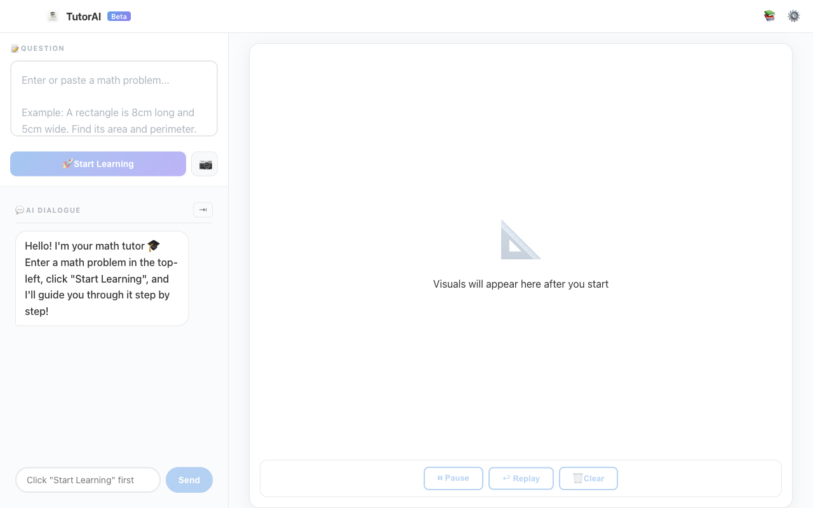
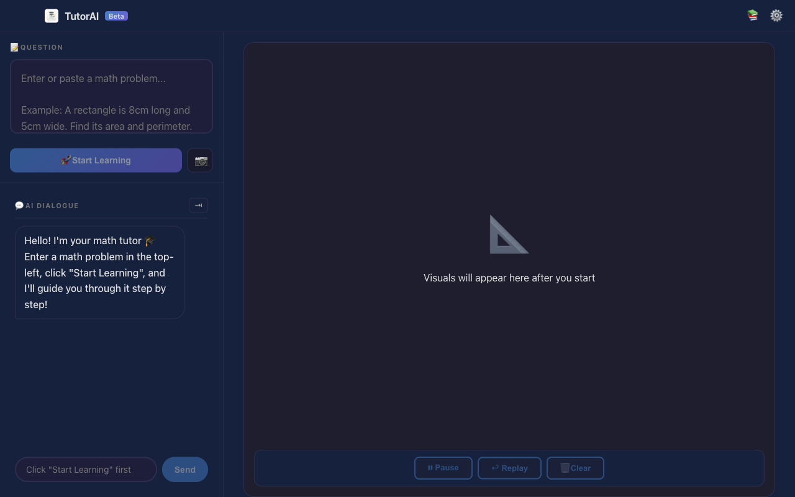
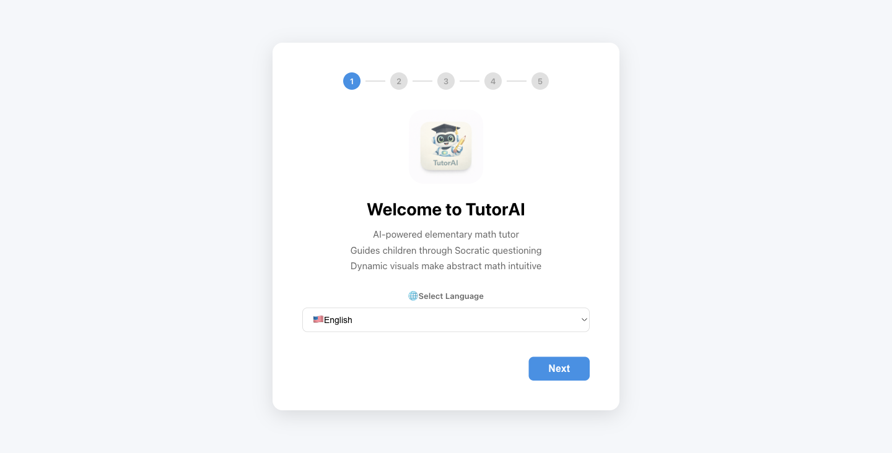
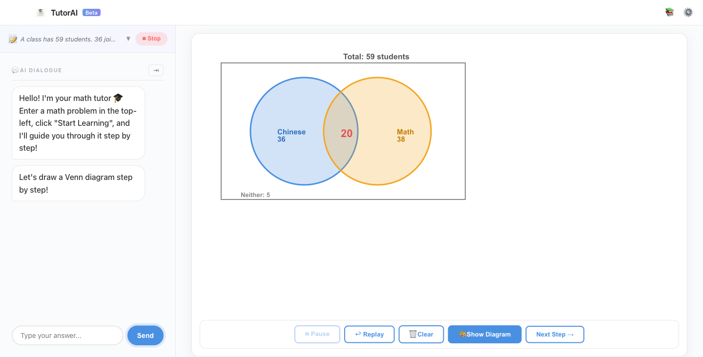
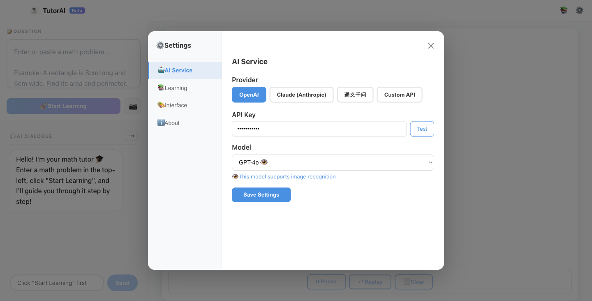

# TutorAI — The AI Tutor That Makes Kids Love Math

> **Never gives away the answer — uses Socratic dialogue to help children reason through problems themselves.**
> Paired with real-time dynamic visual demonstrations to make abstract math intuitive.



[中文文档](README.zh-CN.md)

---

## Why TutorAI?

Most AI tools just hand out answers — kids copy and forget.
TutorAI works like a truly patient personal tutor:

- **Ask, don't tell** — AI guides students to derive answers through step-by-step questions
- **Show, don't just say** — Venn diagrams, number lines, area models… key steps animated live on canvas
- **Track, not one-shot** — Learning records and concept mastery saved locally, continuously tracked

---

## Core Features

### 🧠 Socratic Teaching Method
The AI never gives direct answers. It guides students through chained questions to reason step by step.
After at most 5 rounds of dialogue, the final answer is revealed with a complete summary.

### 🎨 Real-Time Dynamic Visual Demonstrations
Type "show me a diagram" or press `⌘G`, and the AI automatically draws step-by-step animations on the canvas:



| Problem Type | Visual Demo |
|-------------|-------------|
| Area / Perimeter | Rectangle drawn progressively + animated length/width labels |
| Sets / Inclusion-Exclusion | Venn diagram (semi-transparent dual circles + intersection highlight) |
| Distance / Speed | Number line + position and time labels |
| Fractions / Ratios | Divided rectangle + highlighted cells |
| Counting / Arrangements | Table filled cell by cell animation |

### 📷 Photo-to-Problem (Vision OCR)
Take a photo of a problem and upload it — AI Vision automatically recognizes the content and starts explaining immediately.
Supports region cropping to precisely target the problem area.

### 🌍 Multi-Model · Multi-Language
- **AI Models**: OpenAI GPT-5.4 / Claude Opus 4.6 / Alibaba Qwen3 / Custom compatible API
- **Interface Languages**: 中文 / English / 日本語 / 한국어 / Español / Français

### 🔒 Fully Local, Data Secure
Pure Electron desktop app — no backend server. All data stored locally. Bring your own API key, no monthly fees.

---

## Quick Start

### Prerequisites

- Node.js 18+
- An API key from at least one AI provider (OpenAI / Anthropic / Alibaba Cloud Qwen, etc.)

### Install & Run

```bash
# Install dependencies
npm install

# Development mode (Electron + Vite hot reload)
npm run dev

# Production build
npm run build

# Launch packaged app
npm start
```

### First-Time Setup

On first launch, a 5-step setup wizard appears:



1. **Choose Language** — Set your interface language right on the first page
2. **Choose AI Provider** — OpenAI / Claude / Qwen / Custom
3. **Enter API Key** — One-click connection test included
4. **Select Model** — Latest flagship model auto-recommended
5. **Start Learning** 🚀

---

## Usage Example

**Input problem:**
> A class has 59 students. 36 joined the Chinese competition, 38 joined the Math competition, and 5 joined neither. How many joined both?

**AI-guided dialogue:**
```
AI: Let's think this through. How many students are in the class total?
    How many participated in at least one competition?
Student: 59 - 5 = 54 students
AI: Great! Now, what's the total number of competition registrations?
Student: 36 + 38 = 74
AI: Right! 74 registrations for 54 students — what does the difference of 20 represent?
Student: 20 students joined both competitions!
AI: Exactly right! 🎉 ...
```

**After triggering graphic mode, the canvas animates step by step:**
1. Large rectangle (all 59 students)
2. Blue semi-transparent circle (Chinese: 36 students)
3. Orange semi-transparent circle (Math: 38 students)
4. Center "20" label (intersection — students in both)



---



## Tech Stack

| Layer | Technology | Notes |
|-------|-----------|-------|
| Desktop | Electron | Cross-platform (macOS / Windows) |
| UI | React + TypeScript | Component-based, type-safe |
| Graphics | Konva.js | Canvas 2D dynamic rendering |
| Animation | GSAP | Frame-by-frame easing control |
| State | Zustand | Lightweight state management |
| AI Abstraction | Multi-Provider Architecture | OpenAI / Claude / Qwen / Custom |
| OCR | LLM Vision API | No third-party OCR service needed |
| Storage | SQLite (via Electron) | Session records & concept tracking |

---

## Project Structure

```
tutor-ai/
├── src/
│   ├── main/                    # Electron main process
│   └── renderer/                # Renderer process (React SPA)
│       ├── core/
│       │   ├── ai/              # AI Provider abstraction (OpenAI/Claude/Qwen/Custom)
│       │   ├── graphic/         # Konva.js graphics engine
│       │   ├── dialog/          # Dialogue script management
│       │   ├── storage/         # Local storage service
│       │   └── ocr/             # Vision OCR factory
│       ├── components/          # UI components (Settings / HistorySidebar / SetupWizard)
│       ├── store/               # Zustand state (config / dialog / graphic / session)
│       ├── i18n/                # Internationalization
│       └── App.tsx              # Main page orchestrator
├── docs/                        # Design documents & screenshots
└── README.md
```

---

## Supported AI Models

| Provider | Recommended Model | Chat | Vision OCR |
|----------|------------------|------|-----------|
| OpenAI | GPT-5.4 | ✅ | ✅ |
| OpenAI | GPT-4.1 / o4-mini | ✅ | ✅ |
| Anthropic | Claude Opus 4.6 | ✅ | ✅ |
| Anthropic | Claude Sonnet 4.6 | ✅ | ✅ |
| Alibaba Qwen | Qwen3 Max | ✅ | ❌ |
| Alibaba Qwen | Qwen3 VL Flash | ✅ | ✅ |
| Custom | Any OpenAI-compatible API | ✅ | — |

---

## License

MIT
