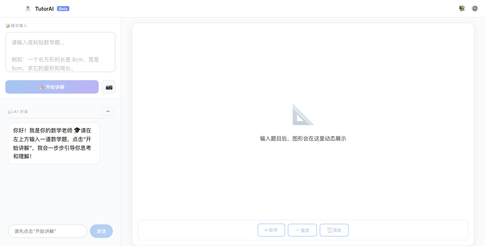
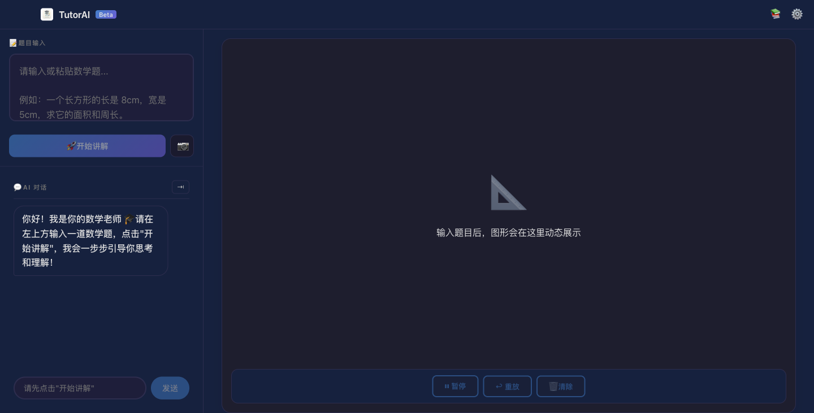
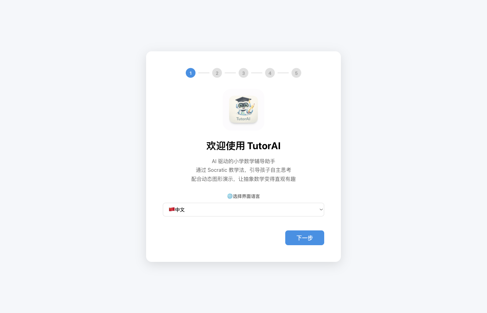
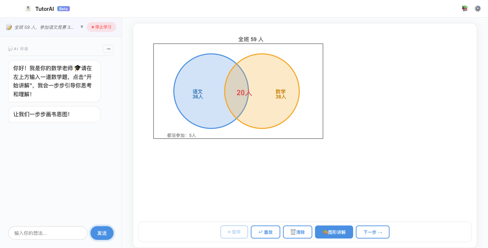
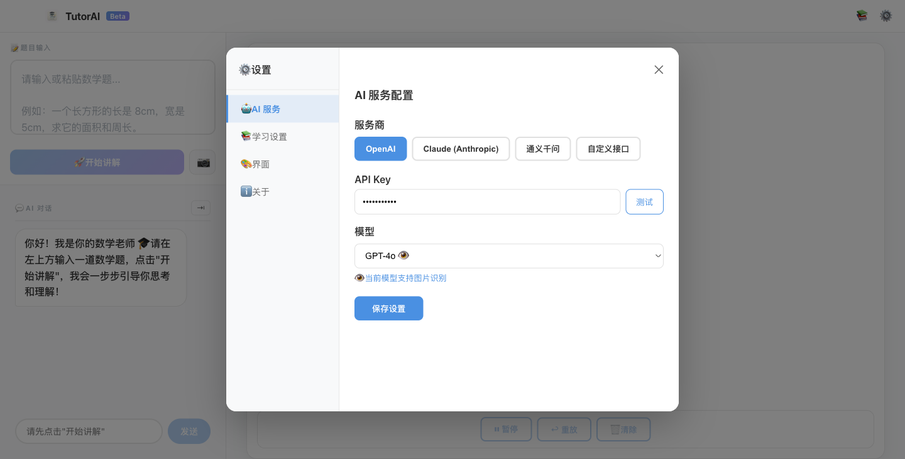

# TutorAI — 让孩子爱上数学的 AI 辅导助手

> **不直接给答案，用苏格拉底式对话引导孩子自己想通。**
> 配合实时动态图形演示，把抽象数学变得直观易懂。



[English](README.md)

---

## 为什么选择 TutorAI？

大多数 AI 工具只会直接给出答案——孩子抄完就忘。
TutorAI 像一位真正有耐心的家教老师：

- **问，而不是答** — AI 通过逐步提问，让孩子自己推导出答案
- **画，而不只是讲** — 韦恩图、数轴、矩形面积……关键步骤在画布上动态演示
- **记，而不是一次性** — 学习记录和知识点掌握情况本地保存，持续追踪进度

---

## 核心功能

### 🧠 苏格拉底教学法
AI 绝不直接给出答案，而是通过连环提问引导孩子一步步推理。
最多 5 轮对话后才揭示最终答案，并给出完整总结。

### 🎨 实时动态图形演示
输入"用图形讲解"或按 `⌘G`，AI 自动在画布上绘制分步动画：



| 题目类型 | 图形演示 |
|---------|---------|
| 面积/周长 | 矩形逐步绘制 + 长宽标注动画 |
| 集合/容斥原理 | 韦恩图（半透明双圆 + 交集高亮） |
| 行程/速度 | 数轴 + 位置时间标注 |
| 分数/比例 | 等分矩形 + 格子高亮 |
| 计数/排列 | 表格逐格填写动画 |

### 📷 拍照识题（Vision OCR）
拍下题目照片上传，AI Vision 自动识别题目内容，即刻开始讲解。
支持选区裁剪，精准定位题目区域。

### 🌍 多模型 · 多语言
- **AI 模型**：OpenAI GPT-5.4 / Claude Opus 4.6 / 通义千问 Qwen3 / 自定义兼容接口
- **界面语言**：中文 / English / 日本語 / 한국어 / Español / Français

### 🔒 完全本地，数据安全
纯 Electron 桌面应用，无后端服务器，所有数据存储在本地。自带 API Key，无月费。

---

## 快速开始

### 前置条件

- Node.js 18+
- 至少一个 AI 服务商的 API Key（OpenAI / Anthropic / 阿里云通义千问等）

### 安装与运行

```bash
# 安装依赖
npm install

# 开发模式（Electron + Vite 热重载）
npm run dev

# 生产构建
npm run build

# 启动打包后的应用
npm start
```

### 首次配置

首次启动会进入新手引导，5 步完成：



1. **选择语言** — 首页即可设置界面语言
2. **选择 AI 服务商** — OpenAI / Claude / 通义千问 / 自定义
3. **输入 API Key** — 支持一键测试连接
4. **选择模型** — 自动推荐最新旗舰模型
5. **开始使用** 🚀

---

## 使用示例

**输入题目：**
> 全班 59 人，参加语文竞赛 36 人，数学竞赛 38 人，两科都没参加的 5 人，求两科都参加的人数。

**AI 引导对话：**
```
AI：我们先来理清一下思路。全班一共有多少人？其中有多少人至少参加了一科比赛？
学生：59 - 5 = 54 人
AI：非常好！那两科报名人数加起来是多少呢？
学生：36 + 38 = 74 人
AI：对！74 人和 54 人，差了多少？这多出来的部分代表什么？
学生：差了 20 人，就是两科都参加的人！
AI：完全正确！🎉 ...
```

**图形讲解触发后，画布上依次动画演示：**
1. 大矩形（全班 59 人集合）
2. 蓝色半透明圆（语文 36 人）
3. 橙色半透明圆（数学 38 人）
4. 中心"20 人"标注（交集区域）



---



## 技术栈

| 层级 | 技术 | 说明 |
|------|------|------|
| 桌面框架 | Electron | 跨平台（macOS / Windows） |
| UI 框架 | React + TypeScript | 组件化、类型安全 |
| 图形渲染 | Konva.js | Canvas 2D 动态图形 |
| 动画引擎 | GSAP | 逐帧缓动动画控制 |
| 状态管理 | Zustand | 轻量状态管理 |
| AI 抽象层 | 多 Provider 架构 | OpenAI / Claude / Qwen / 自定义 |
| OCR | 大模型 Vision API | 无需第三方 OCR 服务 |
| 本地存储 | SQLite（via Electron） | 会话记录与知识点追踪 |

---

## 项目结构

```
tutor-ai/
├── src/
│   ├── main/                    # Electron 主进程
│   └── renderer/                # 渲染进程（React SPA）
│       ├── core/
│       │   ├── ai/              # AI Provider 抽象层（OpenAI/Claude/Qwen/Custom）
│       │   ├── graphic/         # Konva.js 图形渲染引擎
│       │   ├── dialog/          # 对话脚本管理
│       │   ├── storage/         # 本地存储服务
│       │   └── ocr/             # Vision OCR 工厂
│       ├── components/          # UI 组件（Settings / HistorySidebar / SetupWizard）
│       ├── store/               # Zustand 状态（config / dialog / graphic / session）
│       ├── i18n/                # 国际化
│       └── App.tsx              # 主页面协调器
├── docs/                        # 设计文档与截图
└── README.md
```

---

## 支持的 AI 模型

| 提供商 | 推荐模型 | 文字对话 | Vision OCR |
|--------|---------|---------|-----------|
| OpenAI | GPT-5.4 | ✅ | ✅ |
| OpenAI | GPT-4.1 / o4-mini | ✅ | ✅ |
| Anthropic | Claude Opus 4.6 | ✅ | ✅ |
| Anthropic | Claude Sonnet 4.6 | ✅ | ✅ |
| 通义千问 | Qwen3 Max | ✅ | ❌ |
| 通义千问 | Qwen3 VL Flash | ✅ | ✅ |
| 自定义 | 任意 OpenAI 兼容接口 | ✅ | — |

---

## License

MIT
